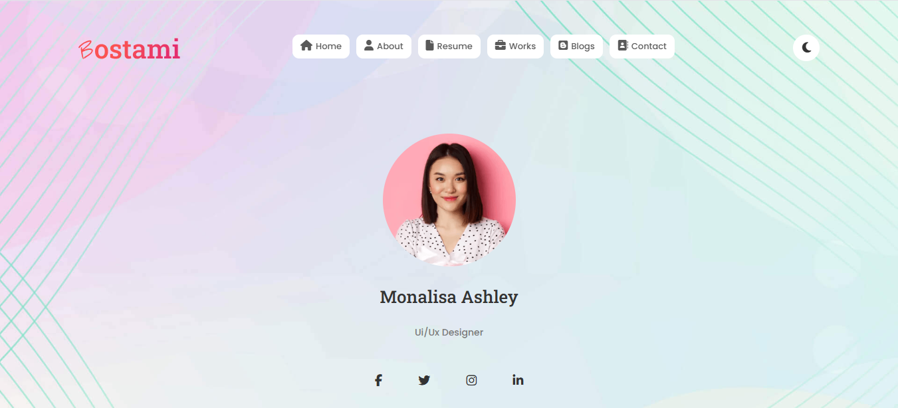

```markdown
# Bostami Professional Portfolio



A modern, responsive portfolio website with dark/light mode toggle functionality, built with Bootstrap 5 and vanilla JavaScript.

## Features

- **Fully Responsive Design**: Works on all device sizes
- **Dark/Light Mode**: User preference is saved in localStorage
- **Modern UI**: Clean, professional design with smooth animations
- **Performance Optimized**: Fast loading and smooth transitions
- **Accessibility**: Proper contrast ratios and semantic HTML

## Technologies Used

- HTML5
- CSS3 (with custom properties)
- JavaScript (ES6)
- Bootstrap 5
- Font Awesome 6
- Google Fonts (Poppins & Roboto Slab)

## Installation

1. Clone the repository:
   ```bash
   git clone https://github.com/yourusername/portfolio.git
   ```
2. Navigate to project directory:
   ```bash
   cd portfolio
   ```
3. Open `index.html` in your browser

## Project Structure

```
portfolio/
├── index.html
├── css/
│   └── style.css
├── js/
│   └── script.js
├── images/
│   ├── asset 0.png       # Logo
│   ├── asset 2.png       # Profile image
│   └── asset 3.jpeg      # Banner background
└── README.md
```

## Customization

### Change Colors
Edit the CSS variables in `style.css`:
```css
:root {
  --primary-color: #fa5252;
  --secondary-color: #dd2476;
  --text-color: #333333;
  --bg-color: #ffffff;
}
```

### Update Content
1. Replace `images/asset 2.png` with your profile photo
2. Update the HTML with your personal information
3. Change social media links in the banner section

### Add New Sections
1. Create a new section in HTML:
   ```html
   <section id="newSection">
     <div class="container">
       <!-- Your content here -->
     </div>
   </section>
   ```
2. Add corresponding CSS in `style.css`

## Dark Mode Implementation

The theme toggle:
- Uses `localStorage` to remember user preference
- Respects system color scheme preferences
- Smoothly transitions between modes

Key JavaScript functions:
```javascript
function enableDarkMode() {
  // Dark mode activation logic
}

function disableDarkMode() {
  // Light mode activation logic
}
```

## Responsive Breakpoints

| Device          | Breakpoint |
|-----------------|------------|
| Mobile          | < 768px    |
| Tablet          | ≥ 768px    |
| Desktop         | ≥ 992px    |
| Large Desktop   | ≥ 1200px   |

## Best Practices Followed

- Mobile-first design approach
- Semantic HTML5 elements
- CSS BEM naming convention
- Optimized image assets
- Minimal third-party dependencies
- Progressive enhancement

## Browser Support

- Chrome (latest)
- Firefox (latest)
- Safari (latest)
- Edge (latest)
- Mobile Safari
- Chrome for Android

## License

MIT License. See [LICENSE](LICENSE) for more information.

## Credits

- Bootstrap 5 (https://getbootstrap.com)
- Font Awesome (https://fontawesome.com)
- Google Fonts (https://fonts.google.com)
- Unsplash (for sample images)

---

**Developed by Md. Shamim Hossain**  
email: shamimthedev@gmail.com 
portfolio: https://shamimthedev.vercel.app/